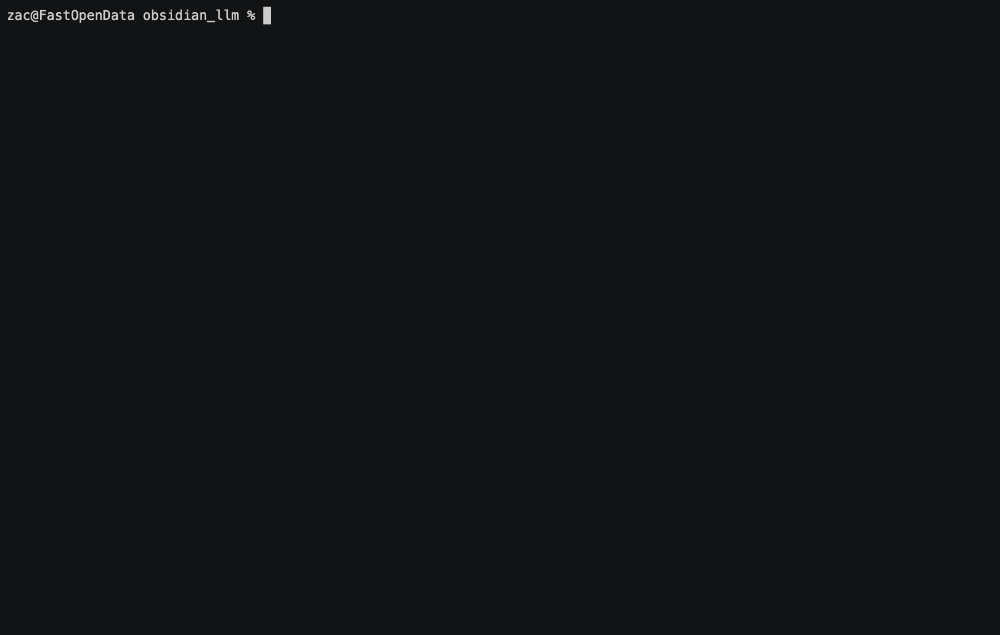

# Ask Obsidian

We don't want to write scripts that use LLMs to do things, but we
have to now because it's the law.

This is a very simple script that reads all the Markdown from an
Obsidian vault, loads it into an ephemeral vector database, and
does a really naive RAG to answer questions. In other words, it 
lets you ask questions to your Obsidian vault.

Assumes you have `OPENAI_API_KEY` set in your environment.

If, for some reason, you want to install this:

```
pip install -e .
```

Make sure that `PYTHONPATH` contains the current directory:

```
export PYTHONPATH=$PYTHONPATH:.
```

Then you should be able to do:

```
ask_obsidian --vault-path=/path/to/your/vault
```

For help:

```
ask_obsidian --help
```
 